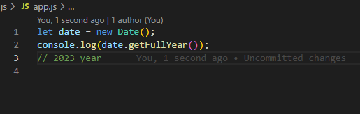
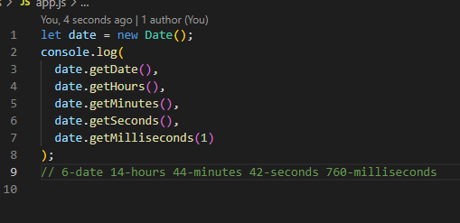
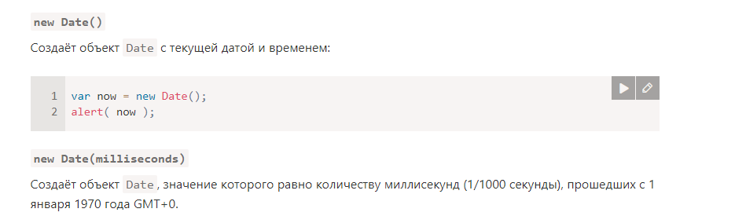
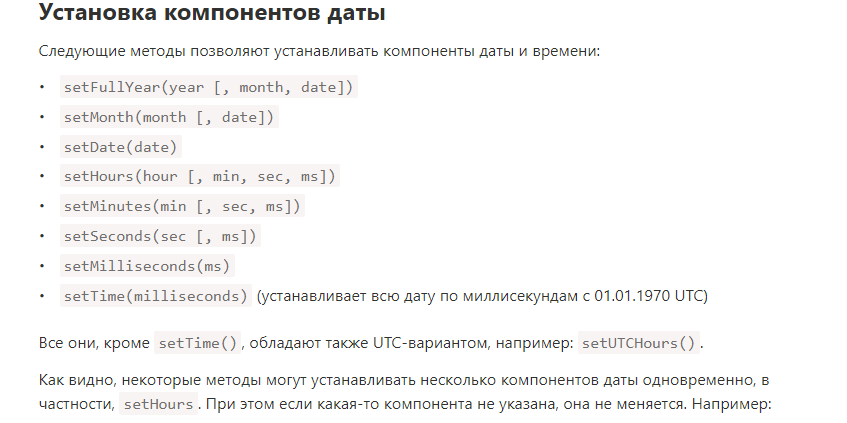
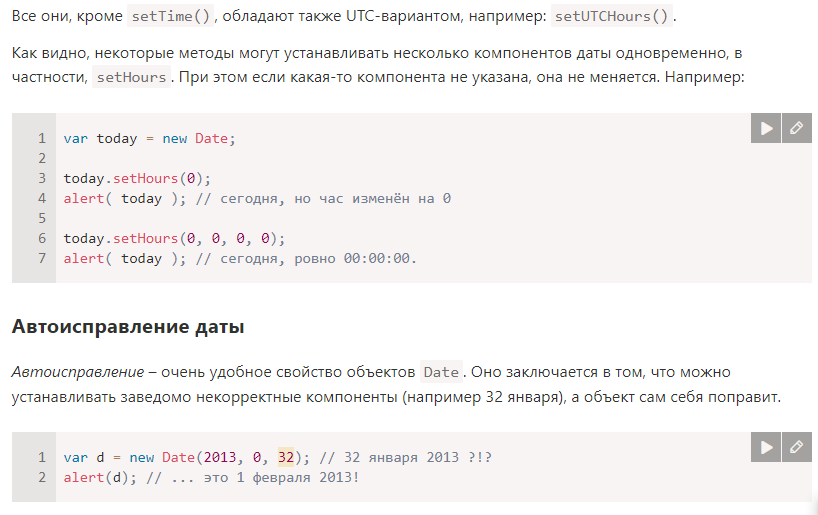

# dataДата и Время

> Для работы с датой и временем в JavaScript используются объекты Date.

# Создание

> Для создания нового объекта типа Date используется один из синтаксисов:
> [

# Получение компонентов даты

> Для доступа к компонентам даты-времени объекта Date используются следующие методы:

getFullYear()
Получить год (из 4 цифр)
getMonth()
Получить месяц, от 0 до 11.
getDate()
Получить число месяца, от 1 до 31.
getHours(), getMinutes(), getSeconds(), getMilliseconds()

> [
> [
> [
> [
